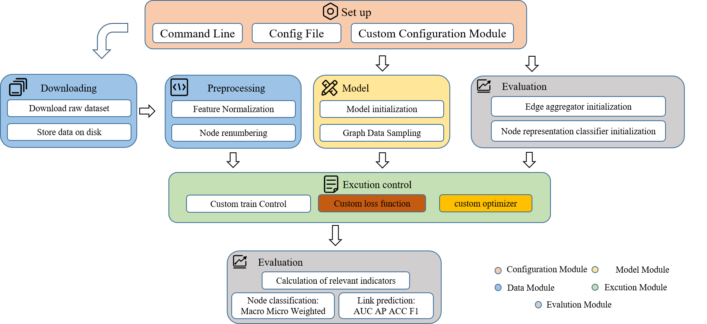

#  DYGL-lib([中文版](./readme_zh.md))
Difficulty in reproducing the code and inconsistent experimental methods hinder the development of the dynamic network field. We present DYDGL-library, a unified, comprehensive, and extensible library for dynamic graph representation learning. The main goal of the library is to make dynamic graph representation learning available for researchers in a unified easy-to-use framework. To accelerate the development of new models, we design unified model interfaces based on unified data formats, which effectively encapsulate the details of the implementation. Experiments demonstrate the predictive performance of the models implemented in the library on node classification and link prediction. Our library will contribute to the standardization and reproducibility in the field of the dynamic graph.
DYGL currently supports **Dynamic Graph Representation Extraction, Link Prediction** and **Node Classification** tasks.

## Overall Framework

* **Configuration Module**: Responsible for managing all parameters involved in the framework.
* **Data Module**: Responsible for downloading datasets, preprocessing datasets, saving and loading datasets.
* **Model Module**: Responsible for initializing the baseline model or custom model.
* **Evaluation Module**: Provides a unified downstream task evaluation model, and evaluates algorithm performance through multiple indicators.
* **Excution Module**: The user defines the loss function, selects the optimizer and the specific process of training.
## GET STARTED

### Install and Setup

DYGL can only be installed from source

```shell
git clone https://github.com/half-salve/DYGL-lib
cd  DYGL-lib
```

### Configure Dependencies
After obtaining the source code, you can configure the environment.
Our code is based on Python version 3.7 and PyTorch version 1.12.0+. For example, if your CUDA version is 11.6, you can install PyTorch with the following command.

conda:
```sh
conda install pytorch torchvision torchaudio pytorch-cuda=11.6 -c pytorch -c nvidia
conda install -c dglteam/label/cu116 dgl
```

### Quick start

Before running the model, make sure that the relevant code and lib are in the same directory. The lib dataset will be processed into the data format of dgl.graph and stored in the DYGL_dataset directory.

The shell 'run_model.py' is used to train and evaluate a single model in lib. When running `'run_model.py'`, the following three parameters must be specified, namely
`task, dataset and model`. You can choose the number of `gpu` in the parameter. If you don’t specify it, it will check whether there is a graphics card that can be used. If there is a graphics card that can be used, it will use the graphics card with `number 0` by default. If there is no graphics card that can be used The graphics card used will use `cpu` to run the model. For example:

```sh
python run_model.py --task link_prediction --model TGN --dataset wikipedia --gpu 0
```

The shell runs the TGN model via `gpu 0` on the wikipeida dataset with default configuration for link prediction tasks.

### Visualization

During the training process of the model, we will record the loss value during each epoch training process and the evaluation results during and after training, which are stored in the `./metric` folder in .npy format.
After the model has been run once, it can be visualized by using the following command:

```sh

```

### Reproduced Model List

A list of all models reproduced in DYGL, their abbreviations and related papers are as follows
| source    | model | title                                                                             |
|-----------|-------|-----------------------------------------------------------------------------------|
| ICLR 2019 | dyrep | Learning Representation over Dynamic Graph                                        |
| KDD 2019  | Jodie | Predicting Dynamic Embedding Trajectory in Temporal Interaction Networks          |
| ICLR 2020 | TGAT  | Inductive Representation Learning on Temporal Graphs                              |
| ICLR 2020 | TGN   | Temporal Graph Networks for Deep Learning on Dynamic Graphs                       |
| ICLR 2021 | CAW   | INDUCTIVE REPRESENTATION LEARNING IN TEMPORAL NETWORKS VIA CAUSAL ANONYMOUS WALKS |


## API REFERENCE

### lib.config

[DGCONFIG(Base Class)](./doc/config/ConfigParser.md) | [ConfigParser](./doc/config/ConfigParser.md)

### lib.data

#### [DYGLDataset(Base Class)](./doc/data/Base_class.md)

#### Link Prediction Datasets

[RedditData](./doc/data/Reddit.md) | [WikipediaDataset](./doc/data/wikipedia.md)

#### Link state change Prediction Datasets

[RedditDataset](./doc/data/Reddit.md) | [WikipediaDataset](./doc/data/wikipedia.md)

#### [lib.data.Utilities](./doc/data/data.utils.md)

### lib.dataloading

#### [RandEdgeSampler](./doc/dataloading/RandEdgeSampler.md) | [NeighborFinder](./doc/dataloading/NeighborFinder.md)

### lib.nn

[CAWconv](./doc/nn/CAWConv.md) | [TGNconv](./doc/nn/TGNConv.md) | [TGAT](./doc/nn/TGATConv.md) | [Jodie](./doc/nn/JodieConv.md) | [DyRep](./doc/nn/derep.md)

### lib.evaluator

#### task for link prediction

[MergeLayer](./doc/evalution/edge_aggregation.md) | [link_prediction_metric](./doc/evalution/edge_aggregation.md)

#### task for node classification

[MLP](./doc/evalution/node_class.md)
